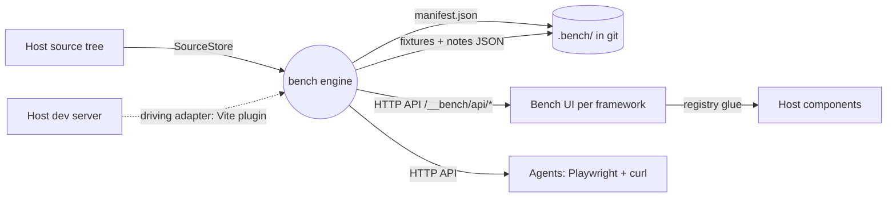

# Bench: Software Architecture Specification

| | |
|---|---|
| **Component** | `bench` |
| **What it is** | An agent-first component workshop: the component catalog derived from source, every rendered state addressable as a URL, all feedback captured as data pinned to those URLs |
| **Status** | Active. Lab + CLI bench + visual bench proven; first host application is next |
| **Version** | 0.1 (spec) · package `0.1.0` |
| **Last updated** | 2026-08-07 |
| **License / home** | MIT, open source: `github.com/andresCamp/bench` (the repo-is-the-database architecture is the product, not a funnel) |
| **Source of truth** | `src/**`. Where this document and the code disagree, the code wins; fix the document |

> Follows the [arc42](https://arc42.org/overview) template. Requirement keywords (**MUST**, **SHOULD**, **MAY**) per [RFC 2119](https://www.rfc-editor.org/rfc/rfc2119).

---

## 1. Introduction & Goals

Storybook's core artifact, the hand-authored story file, should not exist. Bench replaces it with derivation and data: the manifest is extracted from TypeScript source on every change, every knob configuration serializes into a shareable URL, and human/agent feedback lives as JSON pinned to those URLs, committed to git so it travels with branches.

The design serves the five verbs an agent needs against a component library:

| Verb | Surface |
|---|---|
| enumerate | `GET /__bench/api/manifest` (derived, never authored) |
| render | `/__bench/<slug>?prop=value` (state-addressable route) |
| perceive | Playwright against stable state URLs + `data-bench-*` attributes |
| diff | usage scan with `internal` tagging (edit Button, re-verify Card) |
| author | fixtures and notes as JSON files + HTTP API |

### The five invariants

1. **Derived, never authored**: the manifest is a pure function of source text; hand edits are overwritten and meaningless.
2. **Every state is addressable**: any renderable knob configuration round-trips through the state URL grammar, including composed component children (`$component` refs as JSON in the query, the thing Storybook cannot URL-serialize).
3. **Feedback is append-preserving data**: the engine never deletes a note or reply; resolution is a status flip; deletion is a human act outside the engine.
4. **Degrade visibly, never crash**: unsupported prop types, missing fixtures, duplicate names, and unknown components become warnings and visible no-ops.
5. **The contract is framework-neutral**: manifest schema, URL grammar, notes shape, and `.bench/` layout are identical across frameworks and bundlers; only extractors, transports, and render surfaces vary.

### Top quality goals

| # | Goal | Meaning |
|---|---|---|
| Q1 | Zero authored artifacts | Adding a component to the catalog requires writing zero bench-specific files |
| Q2 | Agent operability | Every capability reachable via URL + JSON over HTTP; no GUI-only affordance |
| Q3 | Determinism | Same source in, same manifest out; core has injected clock/ids; the CLI bench prints byte-stable output |
| Q4 | Portability | Vite + Solid today; the port boundary isolates what a React/Svelte or non-Vite host must swap |
| Q5 | Feedback durability | Notes are git-committed data; resolution rides fix commits; nothing lives only in a browser session |

### Stakeholders

Andrés (design review by feel, via the canvas), coding agents (the primary operator: read notes, reproduce states, reply, resolve), host projects that receive bench via the skill, and open-source consumers of the pattern.

---

## 2. Constraints

- **Source-only ESM TypeScript**; no build step; consumers transpile. `main`/`types` point at `./src/index.ts`.
- **`core/**` + `ports/**` MUST stay free of Node globals and framework imports.** The one heavy dependency is the `typescript` package (the extractor); it is pure JS and dev-time only.
- **The route base `/__bench` and the `.bench/` layout are contract, not configuration** (invariant 5). Configurable per host: `componentDir`, usage-scan `excludeDirs`.
- **Notes and fixtures MUST remain plain JSON files** inside the host repo; realtime multi-user sync is explicitly out of scope (single-machine by design).
- **Dev-time only**: bench ships nothing to production bundles; the engine runs in the dev server, the UI mounts on dev routes.
- Org constraints: every contract member has a bench-exercised implementation and a pinned test; the bench (unit level) MUST NOT hijack flow-level verification, which stays with Playwright against the real app.

---

## 3. Context & Scope



**In scope:** the domain model, TS extraction, manifest assembly, state URL grammar, note transitions, doctor checks, the engine facade, memory + node-fs + Vite adapters, the Solid render surface, the CLI and visual benches. **Out of scope (host):** the component library itself, the host's app routes, flow-level QA, production builds.

---

## 4. Solution Strategy

A hexagonal engine applied by an agent, per the onc9 primitive pattern:

- **1.0 (`src/`)**: everything is deterministic code. Extraction, manifest, URL codec, note transitions, doctor. There is no model-backed port; bench's 2.0 layer is the consuming agent itself.
- **2.0 (the agent)**: installs bench into hosts (skill), and operates it daily (read notes, reproduce, fix, reply, resolve).
- **3.0 (data)**: fixtures, notes, the host config (componentDir, excludeDirs), and the skill playbooks.

The seams where hosts differ are the ports: source access, manifest/fixture/note storage, clock/ids, and the two host-idiomatic surfaces (the bundler driving adapter, the framework render surface).

---

## 5. Building Block View

```
src/
├── core/            pure; zero I/O
│   ├── model.ts     types + the five invariants
│   ├── extract.ts   TS AST -> component specs (props, JSDoc, compounds)
│   ├── manifest.ts  buildManifest: specs + usage scan + slug de-collision
│   ├── state-url.ts stateUrl/parseStateUrl/coerceProps/sameState
│   ├── notes.ts     create/reply/resolve/move as pure transitions
│   ├── doctor.ts    runDoctor over gathered artifacts
│   └── engine.ts    createEngine: the driving-port facade
├── ports/index.ts   SourceStore + ManifestStore (required);
│                    FixtureStore + NoteStore (optional, graceful absence);
│                    Clock + Ids (injectable); BenchEngine (driving)
└── adapters/
    ├── memory.ts    every port in memory, with inspection helpers
    ├── node-fs.ts   real stores over the host tree + .bench/
    ├── vite.ts      driving adapter: regenerate-on-change, HMR
    │                suppression for .bench/, the HTTP API
    └── solid/       render surface: registry glue (host calls
                     registerComponents), data client, BenchIndex
                     (specimen sheet), BenchComponent (canvas)
playground/
├── run.ts           CLI bench: full loop offline, deterministic
└── app/             visual bench: a real Vite+Solid host with demo
                     components, fixtures, and committed notes
```

The component registry deliberately lives in the HOST (`registerComponents(import.meta.glob(...))`): `import.meta.glob` resolves relative to the calling file, so the glue must be host-side. It is the entire per-host render contract (~10 lines).

---

## 6. Runtime View

**Manifest loop**: file change under `src/**.tsx` -> debounced `engine.regenerate()` -> `buildManifest` (extract + scan + de-collide) -> `.bench/manifest.json`. `handleHotUpdate` returns `[]` for `.bench/` paths so the write never reloads the page.

**Render loop**: route `/__bench/:slug` -> manifest spec -> knob values from URL search params (fixture `default` as base) -> `coerceProps` with the registry's children resolver -> `<Dynamic>` render. Compound resolution order: registry dotted name -> `target` export -> property access on base -> `BaseSub` convention (survives dev-mode solid-refresh wrappers; do not simplify).

**Note loop**: pin placed on canvas -> `POST /__bench/api/notes/<slug>` -> `createNote` transition -> JSON file write -> optimistic `mutate` in the UI (never `refetch`: a refetch re-triggers page-level Suspense and remounts the canvas).

**Agent loop** (the protocol): read open notes -> open `stateUrl` in Playwright -> fix -> reply as `author: "agent"` -> resolve in the same change -> commit carries code + resolution together.

**Doctor**: `GET /__bench/api/doctor` -> gather stored manifest + rebuild + fixtures raw + notes -> `runDoctor` -> pass/warn/fail checks.

---

## 7. Deployment View

Bench deploys INTO hosts, by agent, via the skill (no npm distribution):

- Copied code: `core/` + node adapters wired for the host's bundler, the framework render surface, the registry glue. A commit-hash comment is the drift receipt.
- Host config: `componentDir` (where components live), `excludeDirs` (where the bench UI was installed).
- `.bench/` scaffold: `fixtures/` and `notes/` committed; `manifest.json` gitignored.
- CLAUDE.md injection: bench-is-truth, verify-after-edit, the notes protocol.

The playground app is the reference deployment and MUST stay runnable offline: `pnpm dev`, app at `:5199`, bench at `/__bench`.

---

## 8. Crosscutting Concepts

- **Graceful degradation lattice**: unsupported prop kind -> visible in manifest, no knob; duplicate name -> de-collided slug + warning; unknown `$component` ref -> literal `[unknown component: X]` text; missing fixture -> `{ states: {} }`; malformed fixture -> empty states + doctor fail; unknown note id -> 404; absent NoteStore -> 501.
- **Determinism discipline**: `generatedAt` is the only timestamp in the manifest and is injected; note ids/times are injected; nothing else may read ambient time or randomness in core.
- **Authorship visibility**: `author: "agent"` renders indigo, humans amber, everywhere feedback appears.
- **Design register** (locked): Apple/Linear; liquid-glass chrome (`.glass`), squircle corners, 16px minimum type in bench chrome, specimen-sheet library (no cards), world-space dot grid, tick-tape zoom rail, ghost-pin note mode. See HANDOFF.md "UI/UX decisions" for the full list; do not regress it.

---

## 9. Architectural Decisions

| # | Decision | Why |
|---|---|---|
| D1 | Repo is the database (fixtures/notes as committed JSON) | Feedback travels with branches; resolution rides fix commits; no backend to run |
| D2 | Registry is host glue, not engine code | `import.meta.glob` is lexically scoped; also keeps the engine framework-free |
| D3 | Route base fixed at `/__bench` | The URL grammar is the contract; configurability would fracture agent muscle memory across hosts |
| D4 | Syntactic extraction (AST), not type-checker | Fast, dependency-light, degrades visibly on imported/computed types; react-docgen took the same stance |
| D5 | Compound targets must also be named exports | dev-mode HMR wrappers hide expando properties; the export is the reliable render path |
| D6 | Notes API returns whole updated notes | Optimistic `mutate` needs the authoritative object without a refetch (Suspense remount trap) |
| D7 | No model-backed port | Nothing in the loop needs an LLM; the agent operates the engine from outside |

---

## 10. Quality Scenarios

| Scenario | Pinned by |
|---|---|
| Same source, byte-identical manifest | `manifest.test.ts` "pure function of source" |
| Composed children survive the URL round trip | `state-url.test.ts` "round-trips composed children" |
| Resolution never deletes; replies append | `notes.test.ts` invariant-3 suite |
| Absent optional ports degrade, not throw | `engine.test.ts` "degrades gracefully" |
| Stale manifest detected | `engine.test.ts` + `doctor.test.ts` freshness checks |
| Duplicate names (incl. compounds) stay addressable | `manifest.test.ts` de-collision tests (lineage bug fixed) |
| Explicit-undefined config cannot clobber defaults | `manifest.test.ts` config-merge test (found live, then pinned) |
| Full loop works offline | `playground/run.ts` (deterministic CLI run) |
| Full loop works in a real browser | Playwright pass over `/__bench` and canvas routes (manual gate, each change) |

---

## 11. Risks & Technical Debt

| Item | Status |
|---|---|
| Imported / intersection prop types show as `unsupported` | Known limit; the right upgrade is optional type-checker extraction behind the same extract seam |
| React/Svelte/Vue extractors and render surfaces | Contractual but unbuilt; contract is framework-neutral, only the Solid surface exists |
| Non-Vite driving adapters (Next, raw express) | Unbuilt; `adapters/vite.ts` is the only transport |
| Note popovers can clip at viewport top | Known UI debt (flip-below-when-no-headroom unimplemented) |
| Relative timestamps don't tick live | Cosmetic, accepted |
| Realtime multi-human sync | Out of scope by design (files, single machine) |
| `benchAuthor` is a module global | Fine for dev-tool scope; revisit if multi-user editing ever lands |
| Skill not yet exercised against a real external host | The first application must pressure-test install/uninstall/work/doctor |

---

## 12. Glossary

| Term | Meaning |
|---|---|
| manifest | The derived catalog: components, props, usages, warnings |
| state URL | `/__bench/<slug>?prop=value...`; the address of one rendered state |
| fixture | Named states as data: `{ states: { name: { prop: value } } }` |
| `$component` ref | A composable fixture value rendering another component |
| note | A feedback pin: stateUrl + selector + coords/rect + thread |
| specimen sheet | The library index: live components on hairline rows, no cards |
| doctor | Deterministic health checks over manifest/fixtures/notes |
| registry glue | The host-side `registerComponents(import.meta.glob(...))` call |
